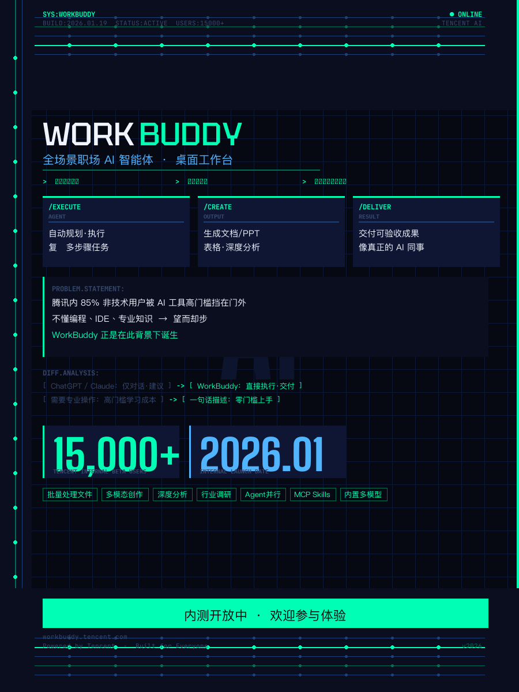

# ✍️ wechat-style-writer

> **公众号文章风格学习与长图 Poster 渲染引擎 v2**

学习任意公众号文章的风格 DNA，然后用同一套设计语言输出 **Markdown + Word + PNG 长图** 三种格式。

---

## 📸 效果预览

### 长图 Poster（核心输出）

基于 `md_to_image_v2.py` 渲染引擎生成的完整公众号长文长图：

<p align="center">
  
</p>

**设计特点：**
- 🎨 纯白背景，极简编辑风格（Financial Times / 经济学人美学）
- 📱 750px 宽度，手机阅读优化，字号比传统排版大 32%
- 📏 统一三级间距系统（GAP_S 10px / GAP_M 16px / GAP_L 24px）
- ✍️ 每张插图右下角自动带草书签名
- 🔤 中英混排优化（PingFang SC + Bricolage Grotesque + JetBrains Mono）

### 海报风格库

三种可复用的海报设计风格：

| 风格 1：Chromatic Silence | 风格 2：Terminal HUD | 风格 3：Warm Editorial |
|:---:|:---:|:---:|
|  |  |  |
| 极简白底 · 深海军蓝主色 · TEAL 点缀 | 赛博终端 · 暗色网格 · 霓虹绿 | 暖调米白 · 金棕色调 · 编辑质感 |

---

## 🏗️ 项目结构

```
wechat-style-writer/
├── md_to_image_v2.py           # 🔥 核心渲染引擎（通用模板）
├── md_to_image_proto.py        # 引擎原型版
├── gen_poster_style1.py         # 风格 1 海报生成器 (Chromatic Silence)
├── gen_poster_style2.py         # 风格 2 海报生成器 (Terminal HUD)
├── gen_poster_style3.py         # 风格 3 海报生成器 (Warm Editorial)
├── gen_poster_*_v2.py           # 各风格 v2 迭代版
├── workbuddy-poster-style*.md   # 风格设计定义文档
│
├── skill_vs_app_full.png        # 完整长图示例输出
├── workbuddy_poster_style*.png  # 海报风格样例
├── proto_card_v01.png           # 原型卡片
│
└── generated-images/            # New Yorker 风格配图素材
    └── *.png                    #   （讽刺漫画 / 视觉隐喻插图）
```

---

## 🚀 快速上手

### 前置依赖

```bash
# 需要 Pillow（PIL）和系统字体
pip3 install Pillow

# 字体文件路径（macOS 自带苹方）：
# - 中文：/System/Library/AssetsV2/com_apple_MobileAsset_Font8/.../PingFang.ttc
# - 英文艺术字体：见 canvas-design/canvas-fonts/
```

### 渲染一张长图 Poster

```bash
# 1. 复制引擎脚本到你的工作目录
cp scripts/md_to_image_v2.py ./my_article.py

# 2. 修改脚本顶部的配置
IMG_DIR = "./my_images"          # 你的配图目录
OUTPUT_PATH = "./poster.png"     # 输出文件名

# 3. 在 main() 中按模板编写文章内容
#    API 速查：
#    r.render_h1("标题")              一级标题（封面）
#    r.render_h2(1, "章节标题")       二级标题
#    r.render_h3("小节标题")          三级标题
#    r.render_body("正文 **加粗**")   正文段落
#    r.render_callout("金句")         金句块（TEAL竖线+底纹）
#    r.render_quote("引用")           引用块（灰竖线+底纹）
#    r.render_bullet("列表项")        无序列表
#    r.render_separator()            分隔线
#    r.render_image("图片.png", cap)  插图+kaku签名
#    r.render_data_row("标签", "值")  数据行
#    r.render_footer("结尾")          结尾
#    r.save("./out.png")             保存PNG @150DPI

# 4. 运行
python3 my_article.py
```

---

## 🎨 设计规范速查

### 配色系统（纯白背景版）

| 名称 | 色值 | 用途 |
|------|------|------|
| NAVY | `#08122A` | 主色：标题、加粗文字、callout |
| TEAL | `#00B2B4` | 强调色：装饰线、圆点、callout 竖线 |
| GRAY_L | `#D2D7DA` | 浅灰：H2 序号、分隔线、footer |
| GRAY_M | `#828A94` | 中灰：标签、caption |
| GRAY_D | `#505A69` | 深灰：引用块文字 |

### 字号表（750px 宽度，+32% 放大）

| 元素 | 字体 | 大小 |
|------|------|------|
| H1 封面 | BricolageGrotesque-Bold | **45px** |
| H2 章节 | PingFang SC Semibold | **30px** |
| H3 小节 | PingFang SC Semibold | **23px** |
| 正文 | PingFang SC Regular | **22px** |
| 引用 | PingFang SC Regular | **20px** |
| 标签/footer | PingFang SC Regular | **17px** |
| 代码 | JetBrains Mono | **16px** |
| 签名 | Nothing You CouldDo | **21px** |

### 三级段后间距

```
GAP_S  10px  → 正文→正文、列表项→列表项
GAP_M  16px  → 正文→callout、callout→正文、引用块→正文
GAP_L  24px  → H2 后、分隔线前后、插图前后
```

---

## 📦 输出格式

| 格式 | 文件类型 | 用途 |
|------|---------|------|
| **Markdown** | `.md` | 源文件 / 版本管理 |
| **Word** | `.docx` | 公众号编辑器直接导入 |
| **PNG 长图** | `.png` | 分享传播 / 朋友圈卡片 / 信息图 |

默认三格式同时输出。

---

## 🔧 核心引擎 API

`CardRenderer` 类提供完整的元素渲染能力：

```python
class CardRenderer:
    def __init__(self, width=750, bg=(255,255,255))
    def render_h1(text)                          # 封面大标题
    def render_h2(number, text)                  # 章节标题(序号+文字)
    def render_h3(text)                          # 小节标题
    def render_body(text)                        # 正文(支持 **bold** )
    def render_bullet(text, dot="●")             # 无序列表
    def render_callout(text)                     # 金句块(TEAL竖线+暖灰底纹)
    def render_quote(text)                       # 引用块(灰竖线+冷灰底纹)
    def render_separator()                       # 分隔线(—·—)
    def render_image(img_path, caption=None)     # 插图+草书签名
    def render_data_row(label, value, highlight=False)  # 数据行
    def render_footer(text="— END —")            # 结尾区
    def save(path)                               # 保存 PNG @150 DPI
```

---

## 🖼️ 配图规范

长图Poster 使用 **New Yorker 讽刺漫画** 风格：

- 提示词模板：`New Yorker style satirical cartoon, bold ink lines, witty visual metaphor, minimalist color accents on white background, sophisticated editorial humor`
- 配图数量：1500-2500字 → 2-3张；2500-4000字 → 3-5张；4000+字 → 5-7张
- 每张插图右下角自动添加 **kaku** 草书签名
- 图文配合原则：**一图一个洞见**

---

## 📝 Skill 集成

本项目作为 [wechat-style-writer](https://github.com/likaku/wechat-style-writer) Skill 的标准渲染引擎使用。

Skill 安装路径：`~/.workbuddy/skills/wechat-style-writer/`

完整 SKILL.md 包含：
- 风格学习与分析工作流
- Markdown → Word 排版规范
- **D.1-D.9 长图 Poster 完整设计标准**（本仓库的核心）
- 公众号文章生成全流程 SOP

---

## License

MIT
